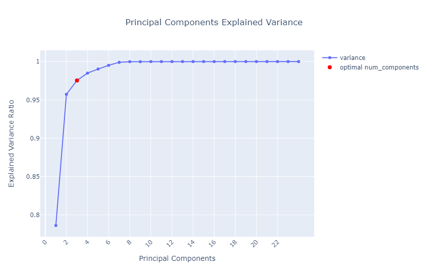

# Readme for PyTorch PCA

## Overview
This project introduces a Principal Component Analysis (PCA) algorithm, implemented in PyTorch using Singular Value Decomposition (SVD). The algorithm mirrors the functionality of Scikit-learn’s `fit()`, `transformation()`, and `fit_transform()` methods. Additionally, it includes a `visualize_variance()` function for visualizing the explained variance ratio. Example plot has been shown below:

Users can specify the number of components for data reduction. If not specified, the optimal number of components is determined based on the explained variance ratio, which defaults to a range of 96% to 100%. Users can also adjust the default expected explained variance ratio and the variance margin to determine the optimal number of components within a range of the expected ratio +/- variance margin.

## Table of Contents

- [Test Data](#test-data)
- [Example Notebook](#example-notebook)
- [Dependencies Installation](#dependencies-installation)

## Test Data
The project utilizes two sets of test data. The first dataset is sourced from Kaggle:
https://www.kaggle.com/datasets/imakash3011/customer-personality-analysis
The second dataset is generated using sklearn’s `make_blobs` function, creating a dataset with 70,000 samples, 6 centers, and 40 features.

## Example Notebook
The example notebook demonstrates the usage of the PCA algorithm, including plots of the explained variance ratio cumulative sum and scatter plots of the data, before and after dimensionality reduction with PCA. Examples of 2D & 3D scatterplots (using the Plotly library) of generated data are shown below:
 
 

## Dependencies Installation
The project was built using Python 3.9.5. All necessary dependencies are listed in the `requirements.txt` file. To install these dependencies, run `pip install -r requirements.txt` from the file’s location.
